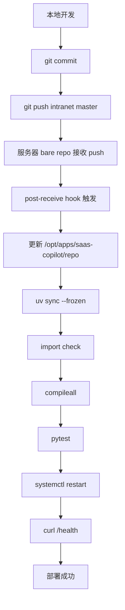

最近我给一个内网服务器部署了一个 SaaS Copilot 的 服务。

一开始我的想法很简单：

> 本地开发，内网服务器部署。

但真正开始做之后，我发现这里其实很适合搭一套轻量 CI/CD。

对于还在 MVP / demo 阶段的小服务，先把下面这条部署闭环跑通：

```text
本地开发
  ↓
git push
  ↓
服务器自动更新代码
  ↓
同步依赖
  ↓
运行测试
  ↓
重启服务
  ↓
健康检查
```

最后我搭出来的是一套非常轻量但完整的流程：

```text
Git bare repo + post-receive hook + uv + pytest + systemd + /health
```

这篇文章记录一下这次流程

---

## 1. CI/CD 到底解决什么问题？

在没有 CI/CD 的情况下，部署通常是这样的：

```text
本地改代码
手动复制到服务器
手动安装依赖
手动重启服务
手动 curl 测试接口
```

这种方式短期可以用，但问题很明显：

- 每次部署都靠记忆；
- 容易漏步骤；
- 不知道服务器现在跑的是哪个版本；
- 不知道依赖是否和本地一致；
- 不知道测试有没有跑；
- 出问题不好定位；
- 多人协作后很容易混乱。

CI/CD 是一套工程流程，不绑定某个具体工具。

它要解决的问题是：

> 代码从“我本地写好了”到“服务器稳定运行”，中间应该经历哪些自动化步骤？

它让部署变得：

```text
可重复
可验证
可追踪
可维护
```

---

## 2. CI 和 CD 分别是什么？

CI 是 **Continuous Integration**，持续集成。

它关注的是：

> 这次代码改动有没有破坏项目？

常见动作包括：

```text
安装依赖
代码检查
类型检查
单元测试
集成测试
构建
```

CD 是 **Continuous Delivery / Continuous Deployment**，持续交付或持续部署。

它关注的是：

> 代码通过检查后，如何发布到目标环境？

如果代码通过检查后，还需要人工点一下发布，一般叫 Continuous Delivery。

如果代码通过检查后，自动发布到目标环境，一般叫 Continuous Deployment。

我这次搭的流程更接近轻量版 Continuous Deployment：

```text
git push intranet master
  ↓
服务器自动部署
```

---

## 3. 当前项目的背景

这个项目是一个 SaaS Copilot 的 Python 服务。

项目使用：

```text
Python 3.12
FastAPI
uv
pytest
systemd
```

uv 可以参考[[uv Quick Start]] 

核心项目结构大概是：

```text
saas-copilot/
├── pyproject.toml
├── uv.lock
├── src/
│   └── saas_copilot/
│       └── main.py
├── tests/
├── deploy/
│   └── deploy.sh
└── frontend/
    └── demo/
```

部署目标是一台内网服务器。

服务器上规划了几个关键目录：

```text
/srv/git/saas-copilot.git          # Git bare repo，只接收 push
/opt/apps/saas-copilot/repo        # 实际运行代码
/opt/apps/saas-copilot/shared/.env # 环境变量，不进 Git
/opt/apps/saas-copilot/logs        # 部署日志
```

这几个目录的职责要分清楚：

```text
/srv/git/saas-copilot.git
  只负责接收代码

/opt/apps/saas-copilot/repo
  负责运行服务

/opt/apps/saas-copilot/shared/.env
  负责保存密钥和环境变量

/opt/apps/saas-copilot/logs
  负责保存每次部署日志
```

---

## 4. 最终部署流程

最终流程如下：



从使用者角度看，日常部署只需要：

```bash
git add .
git commit -m "your commit message"
git push intranet master
```

后面的事情全部交给服务器自动完成。

---

## 5. 为什么用 Git bare repo？

内网服务器上创建了一个 bare repo：

```bash
git init --bare /srv/git/saas-copilot.git
```

本地添加远程仓库：

```bash
git remote add intranet copilot-server:/srv/git/saas-copilot.git
```

之后本地推送：

```bash
git push intranet master
```

这里的 bare repo 不直接运行服务。  
它只是一个 Git 接收端。

真正运行服务的是：

```text
/opt/apps/saas-copilot/repo
```

这样可以避免把“Git 接收目录”和“服务运行目录”混在一起。

这是一个很重要的分离：

```text
Git bare repo：负责接收代码
运行目录：负责部署和运行
```

---

## 6. post-receive hook：CI/CD 的触发器

这套轻量 CI/CD 的核心触发器是 Git hook。

服务器上的 hook 文件是：

```text
/srv/git/saas-copilot.git/hooks/post-receive
```

当本地执行：

```bash
git push intranet master
```

服务器收到 push 后，`post-receive` 会自动执行。

它主要做几件事：

```text
1. 判断是不是 push 到 master 分支
2. 进入部署目录
3. git fetch 最新代码
4. git reset --hard origin/master
5. 执行 deploy/deploy.sh
6. 写入部署日志
```

核心逻辑大概是：

```bash
DEPLOY_BRANCH="master"

while read oldrev newrev refname; do
  branch="${refname#refs/heads/}"

  if [ "$branch" = "$DEPLOY_BRANCH" ]; then
    SHOULD_DEPLOY=1
  fi
done
```

只有 push 到 `master` 会触发部署。

对于我当前这种个人推进的 MVP 项目来说，这已经足够。  
后续多人协作时，可以再升级成：

```text
feature branch → PR → merge master → deploy
```

---

## 7. deploy.sh：把部署说明写成可执行脚本

真正的部署动作放在项目里的：

```text
deploy/deploy.sh
```

它相当于这个项目的“发布说明书”，只不过是可执行的。

它做的事情包括：

```text
1. 确认当前 commit
2. 检查 uv
3. uv sync --frozen
4. 检查 Python 版本
5. import FastAPI app
6. compileall 检查语法
7. pytest 跑测试
8. 重启 systemd 服务
9. curl /health 做健康检查
```

核心逻辑类似：

```bash
UV_BIN="/home/deploy/.local/bin/uv"

"$UV_BIN" sync --frozen
"$UV_BIN" run python --version

"$UV_BIN" run python - <<'PY'
from saas_copilot.main import app
print("Import OK:", app)
PY

"$UV_BIN" run python -m compileall src
"$UV_BIN" run pytest -q

sudo systemctl restart saas-copilot.service

curl -fsS http://127.0.0.1:8010/health
```

这就是一个很典型的轻量 pipeline：

```text
Setup → Check → Test → Restart → Verify
```

---

## 8. 为什么使用 uv？

这个项目使用 `uv` 管理 Python 版本和依赖。

所以部署时不应该再手动：

```bash
python3 -m venv
pip install -r requirements.txt
```

而是应该使用：

```bash
uv sync --frozen
```

原因是项目里已经有：

```text
pyproject.toml
uv.lock
```

`uv.lock` 记录了确定的依赖版本。  
部署时使用：

```bash
uv sync --frozen
```

意味着：

> 严格按照 lockfile 安装依赖，不允许部署时临时变更依赖版本。

这很重要。

否则可能出现：

```text
本地能跑
服务器装到了另一个版本
今天能跑
明天依赖更新后不能跑
```

使用 `uv.lock + uv sync --frozen` 可以让部署更可复现。

这次部署中，服务器最终使用的是：

```text
uv 0.11.13
Python 3.12.13
```

部署日志中可以清楚看到：

```text
Syncing dependencies with uv...
Checked 39 packages
Python version:
Python 3.12.13
```

这说明依赖和 Python 环境都被正确管理了。

---

## 9. systemd：负责长期运行服务

CI/CD 只负责部署，不负责长期托管进程。

长期运行这件事交给 systemd。

服务文件是：

```text
/etc/systemd/system/saas-copilot.service
```

核心配置：

```ini
[Unit]
Description=SaaS Copilot Backend
After=network.target

[Service]
User=deploy
Group=deploy
WorkingDirectory=/opt/apps/saas-copilot/repo
EnvironmentFile=/opt/apps/saas-copilot/shared/.env
Environment=PATH=/home/deploy/.local/bin:/usr/local/bin:/usr/bin:/bin
ExecStart=/home/deploy/.local/bin/uv run --frozen uvicorn saas_copilot.main:app --app-dir src --host 0.0.0.0 --port 8010
Restart=always
RestartSec=5

[Install]
WantedBy=multi-user.target
```

这里有几个重点：

第一，服务用 `deploy` 用户运行，而不是 root。

第二，环境变量从这里读取：

```text
/opt/apps/saas-copilot/shared/.env
```

第三，服务通过 uv 启动：

```bash
uv run --frozen uvicorn saas_copilot.main:app --app-dir src --host 0.0.0.0 --port 8010
```

这样 systemd 不需要知道 `.venv` 里的具体路径。  
它只需要通过 uv 启动应用。

查看服务状态：

```bash
systemctl status saas-copilot.service
```

正常状态应该是：

```text
Active: active (running)
```

---

## 10. /health：部署是否成功的最后判断

服务能启动，不代表部署一定成功。

比如：

```text
进程启动了，但应用没有正确响应
端口监听了，但路由不可用
依赖初始化有问题
配置没有加载成功
```

所以部署最后需要健康检查。

我在 FastAPI 里加了一个简单 endpoint：

```python
@app.get("/health")
def health():
    return {"status": "ok"}
```

部署脚本最后执行：

```bash
curl -fsS http://127.0.0.1:8010/health
```

成功返回：

```json
{"status":"ok"}
```

这才表示：

```text
服务已经启动
端口可以访问
FastAPI app 正常响应
部署后的应用处于可用状态
```

部署成功的标准是：

```text
代码更新成功
依赖同步成功
测试通过
服务重启成功
健康检查通过
```

---

## 11. 一次成功部署的日志

这次最终成功部署时，日志大概是这样的：

```text
HEAD is now at 5cd7653 fix: add simple health endpoint
Current deployed commit:
5cd7653 fix: add simple health endpoint

Checking uv...
uv 0.11.13

Syncing dependencies with uv...
Checked 39 packages

Python version:
Python 3.12.13

Running import check...
Import OK: <fastapi.applications.FastAPI object ...>

Running tests...
41 passed in 1.54s

Restarting service...
Checking health endpoint...
Trying http://127.0.0.1:8010/health
{"status":"ok"}

Health check OK: http://127.0.0.1:8010/health
==== Deploy finished successfully ====
==== Post-receive hook finished ====
```

这里最重要的成功信号是：

```text
41 passed
Health check OK
Deploy finished successfully
```

看到这三项，就可以认为这次部署成功。

---

## 12. 这套方案的适用范围

这套方案已经具备 CI/CD 的核心环节：

|CI/CD 要素|当前实现|
|---|---|
|触发器|`git push intranet master`|
|代码同步|Git bare repo + `git fetch`|
|依赖同步|`uv sync --frozen`|
|测试|`pytest -q`|
|部署|`systemctl restart`|
|健康检查|`curl /health`|
|日志|`/opt/apps/saas-copilot/logs`|
|服务托管|systemd|

它是一套轻量级单机 CI/CD，适合：

```text
个人项目
内网 demo
MVP 验证
小型 Python 服务
早期 SaaS Copilot 原型
```

---

## 13. 它的边界在哪里？

当然，这不是最终形态。

它暂时没有：

```text
Web UI
Pull Request review
部署审批
多环境管理
artifact 管理
自动通知
一键回滚面板
权限分层
```

所以如果后面项目变成多人协作，或者需要正式上线，就可以考虑升级到：

```text
Gitea + Runner
GitLab CI
Jenkins
Docker registry
staging / production 多环境
```

但我现在不想过早引入这些东西。

因为当前项目的核心目标仍然是：

```text
先验证 SaaS Copilot 是否有价值
先让 demo / pilot 跑起来
先建立一个可重复的部署闭环
```

在这个目标下，轻量 CI/CD 比重型平台更合适。

---

## 14. 总结

这套流程把 Git hook、uv、pytest、systemd 和 health check 串成了一个可执行的部署闭环。部署完成后，可以明确知道：

```text
当前服务器跑的是哪个 commit
依赖是否同步成功
测试是否通过
服务是否重启
接口是否可用
```

对这个早期 SaaS Copilot 项目而言，这些信息比一次手动部署更可靠，也足够支撑当前的内网试用。
