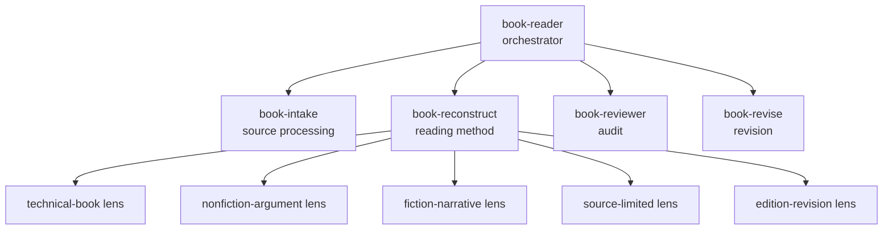

> Book Reader Skills 系列第 2 篇。上一篇[[Book Reader Skills 1 读书不是总结]] 讲了问题定义：读书不是总结。这一篇讲架构：当目标变成知识索引和反庸俗，skills 应该怎么拆。

第一版 `book-reader` 很像一个工具。

它做的事情大概是：

```text
提取文本 -> 切章节 -> 生成笔记 -> 校验结果
```

这条路一开始很自然。因为“让 agent 读书”听起来就是一个流程问题：把书转成文本，再让 agent 逐章读。

后来发现不行。

流程跑完了，书也像是读完了，深度仍然不够。

---

## v1 怎么变成补丁堆了?!!

它能提取文本，能切章节，能生成 workspace，也能跑一些 validation。

每跑一本真实书，都会暴露一个新问题。

章节切错了，就加 reading units。  
notes 太浅，就加 quality floor。  
状态不一致，就加 canonical state。  
文件名不可读，就加 human-readable slug。  
index 空了，就加 index contract。  
review 抓不住问题，就加 reviewer audit。

每一层补丁单独看都合理。堆在一起之后，系统开始变复杂，tools/scripts 越来越多，agent 的注意力也被带偏了。

它会更关心：

```text
文件有没有生成？
状态有没有更新？
目录是不是完整？
validator 有没有通过？
```

这些流程指标会盖过真正的阅读问题：

```text
这本书的问题意识是什么？
这些推断有没有证据？
哪些地方其实还没读清楚？
这本书独特的结构和风格有没有被保留下来？
```

这时我意识到，继续小修意义不大。

---

## 重写 v2

早期项目没有兼容压力，所以我决定重写。

这也是 agent coding 让我越来越习惯的一件事：

> 目标模型变了，就接受推倒重来。
> 知识成为首要资产。

v1 的模型是：

```text
Book -> structured reading workspace
```

v2 的模型变成：

```text
Book -> evidence-linked reconstruction workspace
```

再进一步说：

```text
Book Reader = 一套面向 agent 的读书方法论
```

这个变化背后，还是上一篇说的两个原因：知识索引需要 source、note、model、index、review 这些层次；反庸俗要求 agent 回到原文、保留结构、标出推断，避免顺手写一篇通用读后感。


---

## 一个 skill 不够

一开始我想过只保留一个 `book-reader` skill。后来发现，这会把很多完全不同的职责混在一起。

如果全部塞进一个 skill，最后会变成巨大的 `SKILL.md`。

agent 一加载就看到一堆规则、模板、流程、例外和限制，容易抓不住重点。

所以 v2 拆成了几个角色，形成 method-first skill pack：入口、证据准备、阅读方法、审查、修订和 lenses 各自承担不同职责。




---

## book-reader：只做入口

`book-reader` 是总入口。

它负责理解用户现在要做什么，然后路由到合适的 skill。

比如：

```text
用 book-reader 读这本书
```

通常会走：

```text
book-intake -> book-reconstruct
```

如果用户说：

```text
用 book-reviewer 审查这个 workspace
```

就走 reviewer。

如果用户说：

```text
根据 revision plan 修订
```

就走 revise。

如果是技术书、小说、论文集、修订版书籍，则再选择对应 lens。

它就是调度层。


---

## book-intake：只准备证据

`book-intake` 是最像普通工具的一层。

它负责处理输入：

```text
.txt
.md
.epub
text-based .pdf
```

它做的事情包括提取文本、规范化 Markdown、生成 source metadata 和 source-map、创建 block anchors、初始化 workspace，以及 validate / info。

这些事情低判断、机械、可测试，适合代码做。`book-intake` 的边界也要清楚：它负责准备证据，作者意图、概念系统和论证架构交给 reading method。

这个边界服务于反庸俗。runtime helper 直接生成“作者意图”“核心观点”“风格总结”时，很可能会用 LLM 的默认模式补全，把书读平。

---

## book-reconstruct：方法论核心

`book-reconstruct` 是核心，处理“读书时该如何思考”。

核心链路是：

```text
source block -> note item -> model inference
```

agent 需要避免直接从原文跳到大结论。

它需要先构造 note items：

- observation
- paraphrase
- inference
- uncertainty
- question

然后再把这些 note items 整合成模型：

- author problem
- concept system
- argument architecture
- reader path
- book design
- assumptions and tradeoffs

v2 里，`model/` 是中心，这个中心必须有证据链。model 需要回答：

```text
这个判断来自哪里？
哪条 note 支持它？
置信度是多少？
有没有替代解释？
什么证据会改变它？
```

从知识索引的角度看，`model/` 是后续复用的核心。以后 agent 可以先调用这个模型，再根据需要回到 source block，减少每次都重新读完整本书。

从反庸俗的角度看，`model/` 也应该保留书的独特组织方式，尽量还原它具体的问题、路径和风格，避免改写成“本书从多个角度分析了若干问题”。

---

## book-reviewer：只做审查

`book-reviewer` 单独拆出来，是因为 review 和 reading 是两种不同动作。

由于上下文污染,  self-audit 时常常会说：

```text
整体结构完整，证据链基本充分，后续可以进一步优化。
```

所以 reviewer 最好是独立角色，甚至使用 fresh session。

它要审查：

- model claim 有没有 evidence
- inference 有没有被写成 fact
- confidence 有没有写
- alternative interpretation 有没有写
- index 是否形成知识组织
- source-limited 有没有诚实记录
- reader 有没有自称完成
- 原书的结构和风格有没有被压平成普通套话

---

## book-revise：修订必须重新读

有 reviewer 之后，还需要 reviser。

review 之后，最差的修订方式是补格式。

比如 reviewer 说：

```text
缺 Evidence / Confidence / Alternative
```

reviser 如果只加几个标题：

```text
Evidence:
Confidence:
Alternative:
```

这种修订没有意义。

真正的 revision 应该重新读相关 source block，检查 note item，再决定：

- 补证据
- 降低 confidence
- 改成 uncertainty
- 标记 deferred
- 删除 unsupported claim
- 合并冗余 artifact
- 恢复被 summary 压平的结构和风格


---

## lenses：不同书需要不同读法

书型差异很大，一个统一方法还不够。

读技术书时，阅读对象要扩展到符号系统、公式、定义、例子、证明状态和依赖关系。

读小说时，人物弧线、关系变化、场景功能、主题推进和伏笔更重要，claim-evidence-index 需要谨慎使用。

读论文集时，每篇文章可能相对独立，还要看编辑顺序和合集层面的主题。

所以 v2 加了 lenses。

比如：

```text
technical-book
nonfiction-argument
fiction-narrative
essay-anthology
reference-book
source-limited
edition-revision
external-context
```

lens 给 core method 加一层阅读视角。

原则是：

```text
core invariants + optional lenses
```

core invariants 是所有书都要保留的东西：

```text
evidence
note item
model inference
confidence
alternative
revision condition
```

---

## scripts、references、templates 各自做什么

如果所有内容都塞进 `SKILL.md`，很快就会失控。

最后我采用了这种分工：

```text
SKILL.md      入口和触发条件，尽量短
references/  方法论、判断标准、长规则
templates/   可复用输出结构
scripts/     低判断工具
```

入口短，agent 容易触发。需要复杂判断时，再读 references；需要生成文件时，再看 templates；需要处理输入时，再调用 scripts。

这比一个超长 prompt 稳定，也更适合长期演化。以后加强书型就改 lens，加强审查就改 reviewer，扩展输入格式就改 intake。

---

## 不确定性也要分层处理

v2 将两类不确定性分开处理：

```text
Code fallback handles extraction uncertainty.
Document fallback handles interpretation uncertainty.
```

代码可以处理提取层的不确定性。

比如：

- UTF-8 失败，尝试 GB18030
- EPUB metadata 缺失，标记 unknown
- PDF 某页没有文本，记录 scanned warning
- block-level source-map 做不到，就降级并写 limitation

解释层的不确定性需要留在文档里，不能靠代码自动补。

比如：

- 作者问题不明确
- 概念系统有多个可能
- 论证结构证据不足
- 外部背景需要另查
- 技术书某些证明没读
- 风格判断还没有足够文本支持

这个边界能防止 helper 变成“伪阅读器”。

---

## 发布前才发现：skills 也需要安装体验

到准备发布时，我又发现一个现实问题。

这是一个 skills repo，同时也是 Python 项目。如果只写：

```bash
pip install -e .
```

用户只安装了 Python runtime 依赖时，真正的 skills 还没有进入 agent 能发现的位置。所以最后补了安装脚本：

```bash
python3 scripts/install_skills.py --target opencode-global
python3 scripts/install_skills.py --target opencode-project --project /path/to/project
python3 scripts/install_skills.py --target agents-global
python3 scripts/install_skills.py --target agents-project --project /path/to/project
```

脚本会发现 repo 里的 13 个 skills，并复制到目标目录。

---

## 最终结构

v0.1 最终大概是这样：

```text
skills/
  book-reader/
  book-intake/
  book-reconstruct/
  book-reviewer/
  book-revise/
  lenses/
    technical-book/
    nonfiction-argument/
    fiction-narrative/
    essay-anthology/
    reference-book/
    source-limited/
    edition-revision/
    external-context/
scripts/
  install_skills.py
```

---

## 小结

这次重构让角色边界变清楚了。这些边界共同服务于两个目标：知识索引，让一本书从临时上下文变成 agent 后续可以继续调用、继续审查、继续修订的结构；反庸俗，让 agent 避免把一本有风格、有结构、有锋利度的书，重新读成一堆通用套话。

这让 `book-reader` 从工具流变成了方法论系统。
